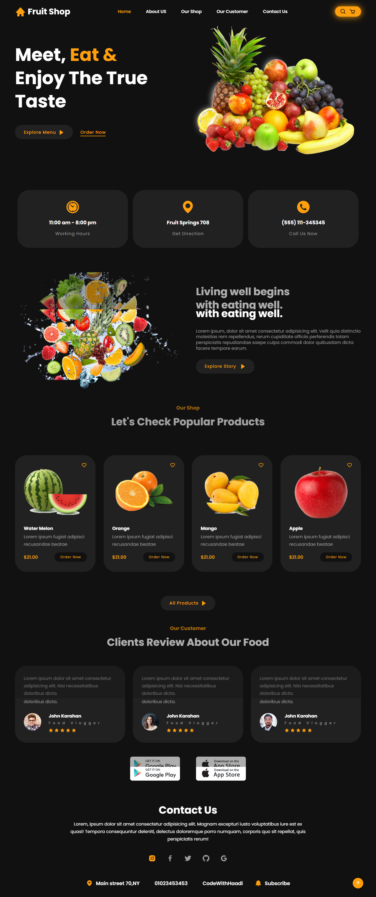

##### This is an exapmle of a Honey website. It's fully responsive, modern.
# <a target="_blank" href="https://darkleas.github.io/honey-website-reactjs/">Demo Link</a>
<<<<<<< HEAD

# Getting Started with Create React App

## Available Scripts

In the project directory, you can run:

### `npm start`

Runs the app in the development mode.\
Open [http://localhost:3000](http://localhost:3000) to view it in the browser.

=======

# Getting Started with Create React App

## Available Scripts

In the project directory, you can run:

### `npm start`

Runs the app in the development mode.\
Open [http://localhost:3000](http://localhost:3000) to view it in the browser.

>>>>>>> 4b4131ede2890e21a39a8478b8d48bfd986aee4c
